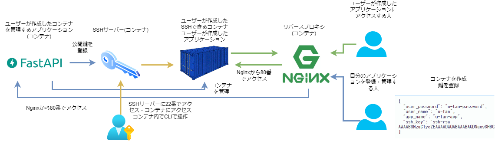

# rori-stack

レンタルサーバーもどき

## 構成図



## 開発環境

### windows の場合

#### コンテナを起動

```sh
# git clone
$ git clone git@github.com:OHMORIYUSUKE/rori-stack.git
$ cd rori-stack
# .envを作成
$ cp ./secure/.env.sample ./secure/.env
$ cp ./ssh-server/.env.sample ./ssh-server/.env
$ cp ./admin/.env.sample ./admin/.env
# 必要なコンテナを作成
$ sh make.sh
```

#### hosts ファイルを編集

```hosts
127.0.0.1 app.secure.example.local
127.0.0.1 phpmyadmin.secure.example.local
127.0.0.1 u-tan-app.ec3.example.local
127.0.0.1 ssh.example.local
```

上記を追記する。

#### SSH 鍵を作る

```sh
$ cd ~/.ssh
$ ssh-keygen -f u-tan
```

#### 試す

`http://app.secure.example.local/docs`にアクセス

create/container に以下のような json を入力する。`ssh_key`は`cat ~/.ssh/u-tan.pub`の値に差し替える。

```json
{
  "user_password": "u-tan-password",
  "user_name": "u-tan",
  "app_name": "u-tan-app",
  "os_type": "ubuntu",
  "ssh_key": "ssh-rsa AAAAB3NzaC1yc2EAAAADAQABAAABgQDLO+vEs9KkiiIuSql+HGg20+TIhtOMobn0SiAP7qP+oE/R2pNUfmCuaMtuBs/yrF+EXyWs+kJm06Wz+cWx2ibu6uL2YYgRsWGjoGNfeCPBYblWtBV5JijqcnncQrbFpw7ovCqjS7kS4zu0Syf3f3AQzZdIs2CO0eRyoYyYZdK9HOrDa7jFf6GpmQTocMwxUyodw/tkSk4hZO1k3Fo+0atqk4o5KncwQ94FR+aFDbGBOFuE3MQRAcAYzQkgWbs0ur0NudjIKi4WY1shr4PF+2Dg1APD0r1z52TdtI178qL+Dod4neiazvtEr/Sc8X/nv5L7jq35GzuqNxgYb0c2BoPkXScfRsWxlrbdWd9WcXh0DfHfVvLKlxYBNvK79MyaAX8eqLTVVTW1HAsAwXanuklZ/6aqCBwZKtC1cTstACCHtvdqjdzvsR+sWyR3Bb6fdWN9v/K/aNoIoTTSGSQ3Yzwssg2j3UZFk1BCDavybHS9qSkIbOcbMgDTTmLIFyQjyU8= 81908@LAPTOP-SALKU03L"
}
```

loading が終わったら、コンテナに SSH をする。以下のコマンドを入力する。

```sh
$ ssh u-tan@ssh.example.local -i ~/.ssh/u-tan
```

コンテナに入れたら成功。

#### WEB サーバーをコンテナ内で動かす

コンテナ内で apache か nginx を起動する。sudo で聞かれるパスワードは`u-tan-password`と入力する。

```sh
$ sudo apt update
# apache install
$ sudo apt install apache2
$ systemctl status apache2
● apache2.service - The Apache HTTP Server
   Loaded: loaded (/lib/systemd/system/apache2.service; enabled; vendor preset: enabled)
  Drop-In: /lib/systemd/system/apache2.service.d
           └─apache2-systemd.conf
   Active: inactive (dead)
$ sudo systemctl start apache2
# nginx install
$ sudo apt install nginx
$ sudo systemctl start nginx
```

完了したら、ブラウザから`http://u-tan-app.ec3.example.local`にアクセス。インストールした WEB サーバーが表示されたら成功。

## volume の解説

ssh-server コンテナの`/share-volume/ssh-server/`ディレクトリと secure コンテナの`/ssh-server/`ディレクトリの中身は常に同期されている。そのため、secure コンテナの`/ssh-server/`ディレクトリに保存された ssh 鍵は ssh-server コンテナから操作することができる。

### おかしな挙動の解決策

#### mysql

mysql インストール後に以下を行うと mysql コンソールに入れる。

```sh
$ sudo touch /var/run/mysqld/mysqld.sock
$ sudo mysql -u root
```

#### vim

vim 文字化けの解消

```sh
# ubuntu
$ export LANG=C.UTF-8
# centos
$ LANG="en_US.utf8"
```
